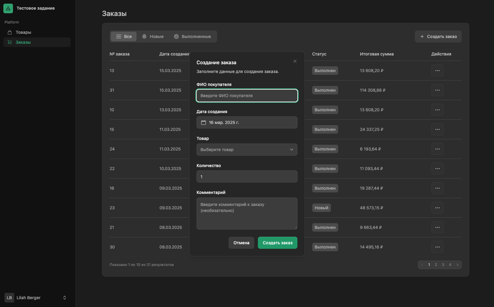
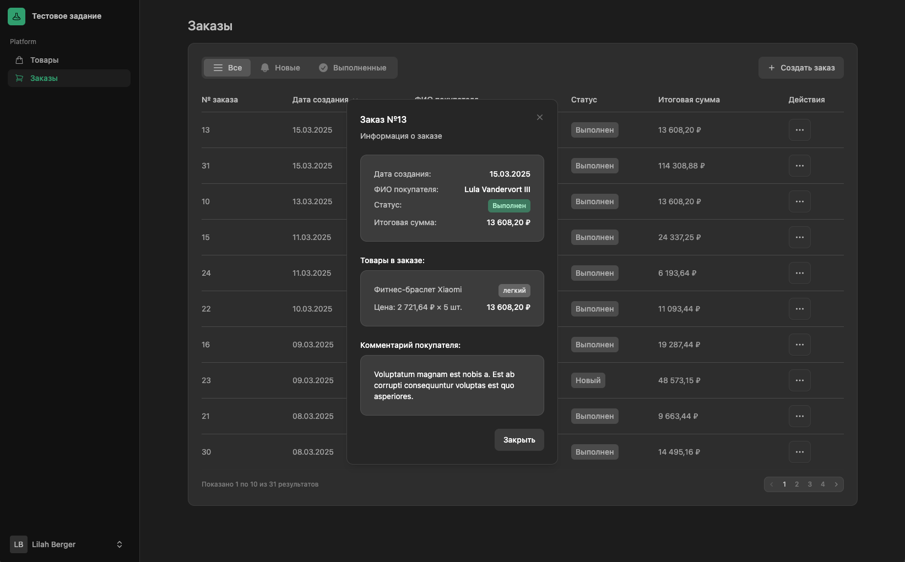

# Управление товарами и заказами - Laravel приложение

Это веб-приложение для управления товарами и заказами, разработанное с использованием Laravel 11 и Livewire 3.

## Требования

- PHP 8.1 или выше
- Composer
- Node.js и NPM (для компиляции фронтенд ресурсов)
- SQLite (для базы данных)

## Установка

1. Клонируйте репозиторий:
```bash
git clone https://github.com/Fulue/MPFIT.git
cd MPFIT
```

2. Установите зависимости PHP:
```bash
composer install
```

3. Установите зависимости JavaScript:
```bash
npm install
```

4. Скомпилируйте фронтенд ресурсы:
```bash
npm run build
```

5. Скопируйте файл `.env.example` в `.env`:
```bash
cp .env.example .env
```

6. Сгенерируйте ключ приложения:
```bash
php artisan key:generate
```

7. Настройте соединение с SQLite в файле `.env`:
```
DB_CONNECTION=sqlite
# Уберите следующие строки или закомментируйте их
# DB_HOST=127.0.0.1
# DB_PORT=3306
# DB_DATABASE=laravel
# DB_USERNAME=root
# DB_PASSWORD=
```

8. Создайте пустой файл SQLite базы данных:
```bash
touch database/database.sqlite
```

9. Выполните миграции и заполните базу данных начальными данными:
```bash
php artisan migrate --seed
```

10. Запустите сервер разработки:
```bash
php artisan serve
```

Теперь приложение должно быть доступно по адресу: `http://localhost:8000`

## Функциональность

### Управление товарами:

- Просмотр списка товаров с сортировкой и пагинацией
- Добавление новых товаров
- Редактирование существующих товаров
- Удаление товаров
- Просмотр детальной информации о товаре

### Управление заказами:

- Просмотр списка заказов с фильтрацией по статусу и сортировкой
- Создание новых заказов с выбором товара и количества
- Просмотр детальной информации о заказе
- Изменение статуса заказа на "выполнен"
- Удаление заказов

## Архитектура

Приложение разработано с использованием принципов многослойной архитектуры:

1. **Слой представления** - Livewire компоненты для взаимодействия с пользователем
2. **Сервисный слой** - содержит бизнес-логику приложения
3. **Слой доступа к данным (репозитории)** - отвечает за работу с базой данных
4. **DTO** - объекты для передачи данных между слоями

## Структура проекта

- `app/Contracts/Repositories` - интерфейсы репозиториев
- `app/Contracts/Services` - интерфейсы сервисов
- `app/DTO` - объекты передачи данных
- `app/Livewire` - Livewire компоненты
- `app/Models` - модели Eloquent
- `app/Providers` - сервис-провайдеры
- `app/Repositories` - реализации репозиториев
- `app/Services` - реализации сервисов
- `database/migrations` - миграции базы данных
- `database/seeders` - сидеры для заполнения базы данных
- `resources/views/livewire` - шаблоны Blade для Livewire компонентов

## Технологии

- **Laravel 11** - PHP фреймворк
- **Livewire 3** - фреймворк для создания динамических интерфейсов
- **Flux UI** - набор компонентов пользовательского интерфейса
- **SQLite** - легковесная СУБД
- **Tailwind CSS** - CSS фреймворк
- **Alpine.js** - JavaScript фреймворк для интерактивности

## Скриншоты приложения

Ниже представлены скриншоты основных экранов приложения:

### Список товаров

*Страница со списком товаров и возможностью сортировки*

### Добавление товара

*Модальное окно создания нового товара*

### Редактирование товара

*Модальное окно редактирования существующего товара*

### Список заказов

*Страница со списком заказов с фильтрацией по статусу*

### Создание заказа

*Форма создания нового заказа*

### Просмотр заказа

*Детальная информация о выбранном заказе*
